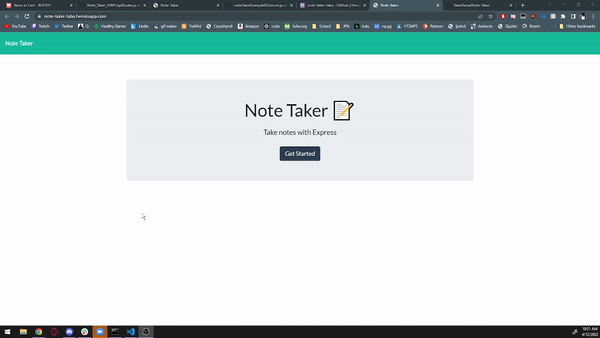

# Note Taker App

  

  ***
  ## Table of Contents
  - [Description](#description)
  - [Visual Presentation](#visual-presentation)
  - [Technologies Used](#technologies-used)
  - [Installation](#installation)
  - [Usage](#usage)
  - [Contribution](#contribution)
  - [Testing](#testing)
  - [Additional Info](#additional-info)

  ***
  ## Description
  Write and save notes online!

  ***
  ## Technologies Used
  

  ***
  ## Visual Presentation
  

  ***
  ## Installation
  Simply open the webpage, no installation needed.

  ***
  ## Usage
  Note taking

  ***
  ## Contribution
  Any can contribute, simply fork the github repo.

  ***
  ## Testing
  N/A

  ***
  ## Additional Info
  - Github: TabuHana(https://github.com/TabuHana)
  - Email: nate31196@outlook.com
